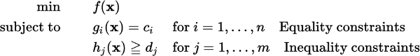

Social Cognitive Optimization (SCO)
===================================

SCO is a population-based metaheuristic optimization algorithm for solving numerical optimization problems as

where f(x) is the objective function and each g(x) is a constraint function to be satisfied, and _c_ and _d_ are constants. All the functions can be nonlinear and nonsmooth.

General information
-------------------

Portal: http://www.wiomax.com/sco
E-MAIL: Xiao-Feng Xie <xie@wiomax.com>

Quick start
-----------

- Execute: Enter the directory "example", then run the file "run.sh".

- Compile: Type "ant" to build, and the output file will be release/sco.jar. 

- See source/problem for examples of constrain and unconstrained numerial optimization problem instances.

License
-------

See the [Creative Commons Non-Commercial License 3.0](https://creativecommons.org/licenses/by-nc/3.0/us/) for more details.

Please acknowledge the author(s) if you use this code in any way.

