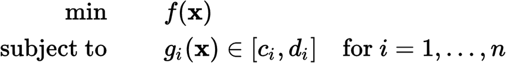

Social Cognitive Optimization (SCO)
===================================

SCO is a population-based metaheuristic optimization algorithm simulating the dynamic process of social cognition. It can be incorporated into [cooperative group optimization](http://www.wiomax.com/optimization) (CGO) system.

The [SCO paper](http://www.wiomax.com/team/xie/paper/ICMLC02A.pdf) has been [cited](https://scholar.google.com/scholar?cites=4791188436623784067,8530045607228404517) over 70 times with various applications. SCO was also implemented (by Sun Microsystems Inc.) into [NLPSolver](https://wiki.openoffice.org/wiki/NLPSolver) (Solver for Nonlinear Programming), an extension of Calc in Apache OpenOffice.

Problem to be Solved
--------------------
It solves (constrained) numerical optimization problem (NOP) or the nonlinear programming problem (NLP):

where f(x) is the objective function and each g(x) is a constraint function to be satisfied, and _c_ and _d_ are constants. All the functions can be nonlinear and nonsmooth.

General information
-------------------

Portal: http://www.wiomax.com/sco
E-MAIL: Xiao-Feng Xie <xie@wiomax.com>

Quick start
-----------

- Execute: Enter the directory "example", then run the file "run.sh".

- Compile: Type "ant" to build, and the output file will be release/sco.jar. 

- See source/problem for examples of constrain and unconstrained numerial optimization problem instances.

License
-------

See the [Creative Commons Non-Commercial License 3.0](https://creativecommons.org/licenses/by-nc/3.0/us/) for more details.

Please acknowledge the author(s) if you use this code in any way.

